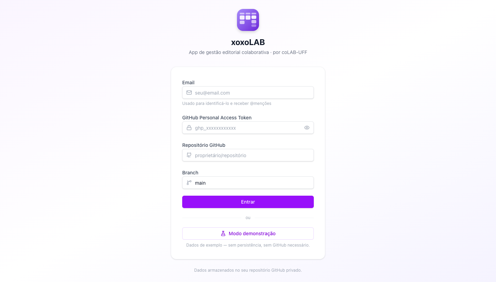
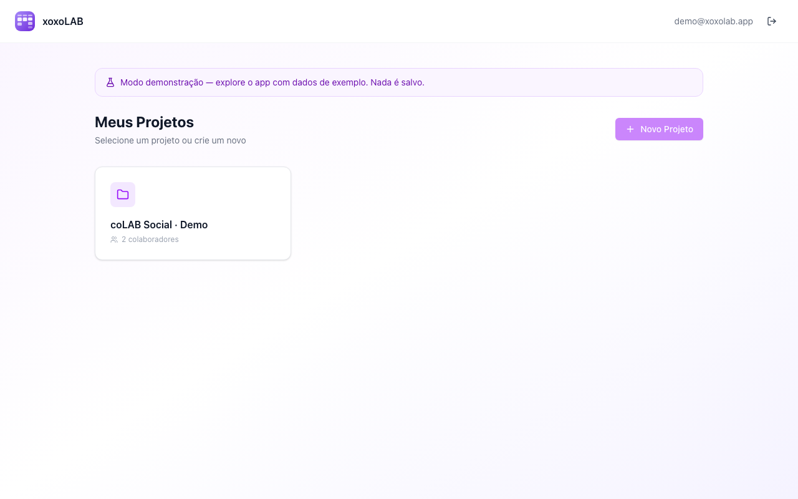
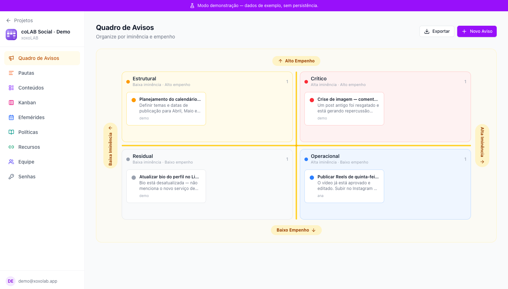
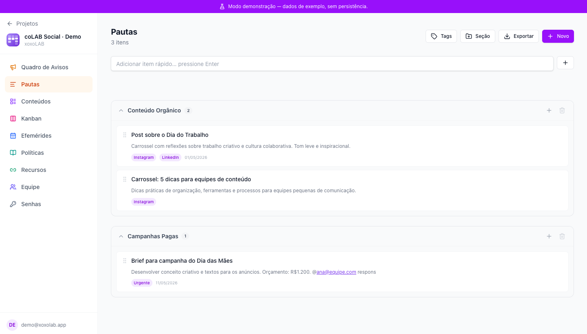
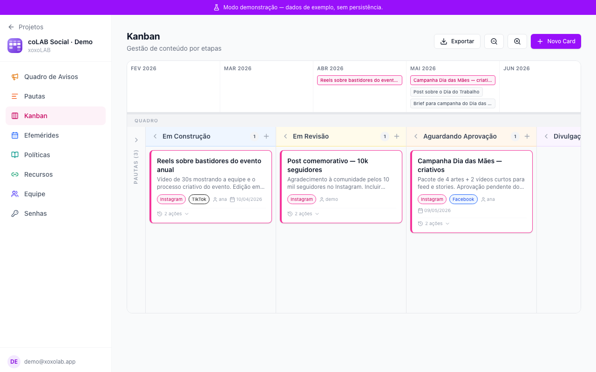
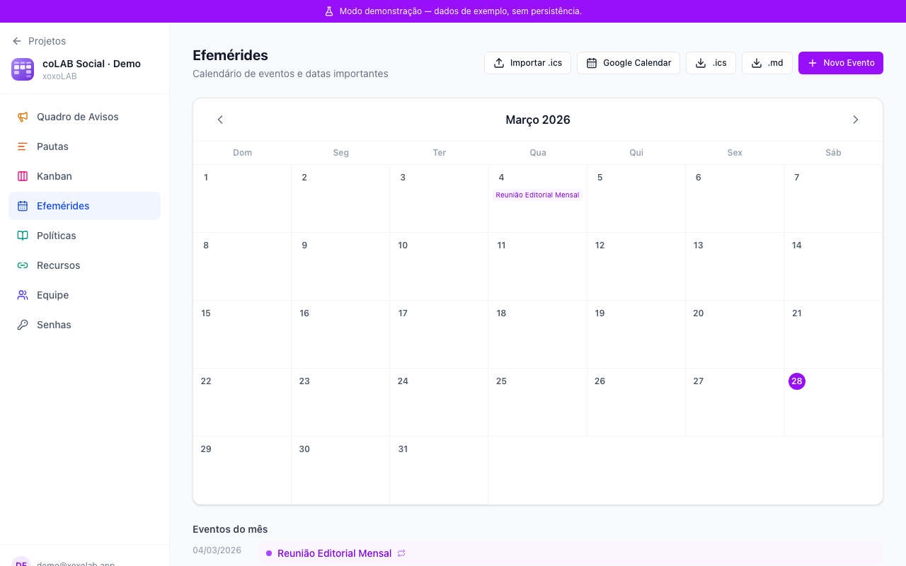
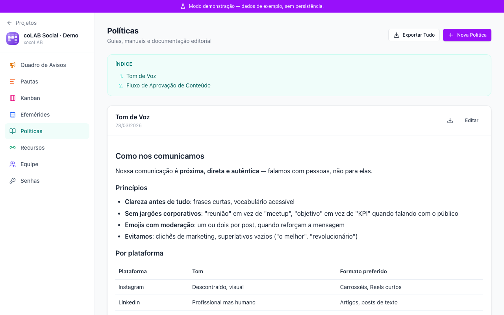
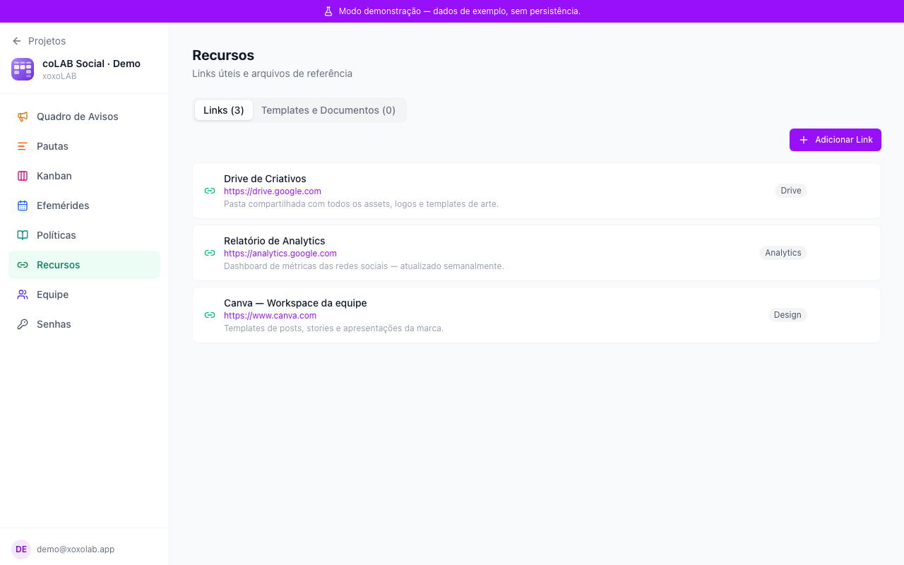
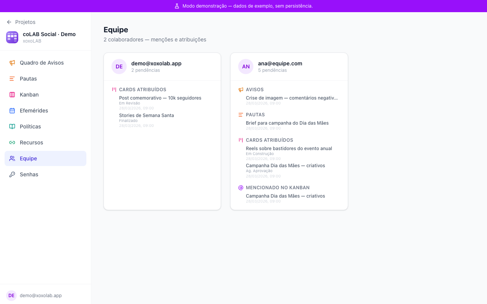
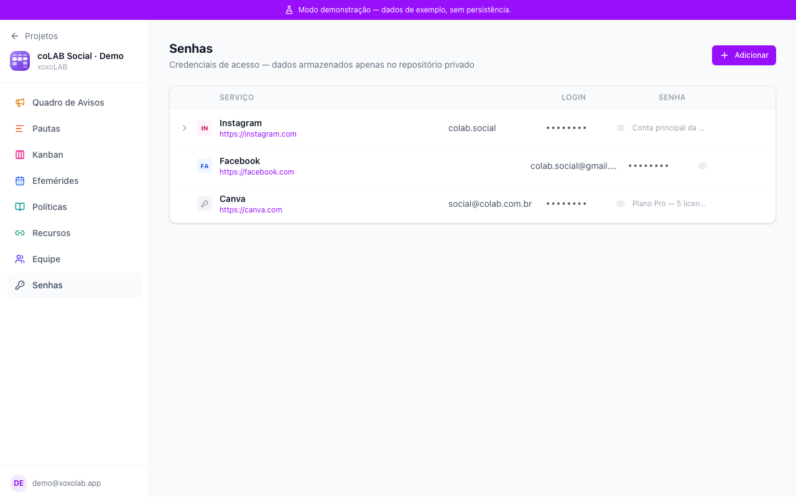

# :pencil2: xoxoLAB

**Gestão colaborativa de mídias sociais**

O xoxoLAB é uma ferramenta web de gestão editorial colaborativa que reúne em uma única interface oito instrumentos de trabalho para equipes de comunicação e mídias sociais: quadro de avisos, pautas, kanban, efemérides, políticas, recursos, equipe e senhas, todos conectados por um sistema de @menções que notifica colaboradores em tempo real. Os dados são armazenados diretamente no repositório GitHub privado da própria equipe, sem servidor intermediário, e múltiplos projetos podem ser gerenciados simultaneamente por diferentes grupos de colaboradores, cada um com seu próprio espaço isolado de trabalho.

O software foi desenvolvido por [Viktor Chagas](https://scholar.google.com/citations?user=F02DKoAAAAAJ&hl=en) e pelo [coLAB/UFF](http://colab-uff.github.io), com auxílio do Claude Code Sonnet 4.6 para as tarefas de programação. Os autores agradecem a Rafael Cardoso Sampaio pelos comentários e sugestões de adoção de ferramentas de IA, que levaram ao planejamento inicial da aplicação.

---

# :octocat: Frameworks

O xoxoLAB é desenvolvido em TypeScript com React 19 como framework de interface, utilizando Vite 7 como bundler e servidor de desenvolvimento. A estilização é feita com Tailwind CSS v4 via plugin oficial para Vite, e os componentes de interface são construídos diretamente sobre primitivos Radix UI com utilitários cva, clsx e tailwind-merge. O roteamento é feito com React Router v7 com rotas aninhadas por projeto, e o gerenciamento de dados assíncronos é feito com TanStack Query v5. Recursos adicionais incluem @hello-pangea/dnd para drag-and-drop em pautas e kanban, date-fns para manipulação de datas, react-markdown com remark-gfm para renderização de Markdown, jsPDF e jspdf-autotable para exportação em PDF, html2canvas para exportação em PNG, xlsx para planilhas, docx para documentos Word e js-yaml para serialização dos dados, além de @emailjs/browser para notificações opcionais por e-mail.

Toda a persistência de dados ocorre diretamente em um repositório GitHub privado da equipe por meio da GitHub Contents API (REST), sem banco de dados externo. Os dados são armazenados em arquivos YAML organizados por projeto e por módulo no repositório. O projeto não depende de nenhum serviço de backend próprio — o navegador se comunica diretamente com a API do GitHub, e cada colaborador autentica-se com seu próprio Personal Access Token.

---

## Módulos


### 1. Gestão de Projetos

O xoxoLAB permite gerenciar várias contas e projetos simultaneamente. Assim, equipes de produção de conteúdo para as mídias sociais podem gerenciar várias páginas e perfis em um único ambiente. Ao efetuar o login no software, é preciso indicar um email, que funcionará como nome de usuário. As equipes podem atribuir tarefas e notificar usuários por meio de um sistema de menções (@).



#### Como usar

1. Acesse a aplicação
2. Informe seu **email** e as demais credenciais de acesso
3. Crie ou acesse um projeto e convide colaboradores pelos seus emails

Os dados ficam inteiramente no seu repositório GitHub privado.




### 2. Quadro de Avisos

Um quadro de recados colaborativo organizado como uma Matriz Eisenhower, para priorização de comunicados internos da equipe.



- **4 Quadrantes** organizados por eixos de Iminência (horizontal) e Empenho (vertical): Crítico, Estrutural, Operacional, Residual
- Cards com título, descrição em Markdown, prioridade, suporte a @menções
- Clique no marcador colorido arquiva o card na área "Concluídos" (colapsável)
- **Export**: PNG, PDF (paisagem), Excel, Markdown


### 3. Pautas

Listas organizada por seções temáticas, com suporte a drag-and-drop. Utilize para definir ideias para pautas a serem elaboradas.



- Seções customizáveis (criar, reordenar, excluir)
- Itens com título, corpo em Markdown, tags coloridas, data, responsável e @menções
- Reordenação de itens por DnD dentro e entre seções
- Quick-add por Enter direto na lista
- Sincronização com Kanban: itens de Pauta aparecem automaticamente na coluna "Pautas" do Kanban
- **Export**: PDF, Excel, CSV, Markdown


### 4. Kanban

Quadro de gestão de conteúdo por etapas com timeline visual. O Kanban de xoxoLAB possui 6 colunas (Pautas, Em Construção, Em Revisão, Aguardando Aprovação, Divulgação, e Finalizadas), sendo duas colunas ocultas por padrão (Pautas e Finalizadas). O módulo sincroniza automaticamente com as ideias inseridas no módulo de Lista de Pautas e com as datas inseridas no módulo Efemérides. Uma Linha do Tempo permite visualizar de forma abrangente os prazos e efemérides próximos.



- **6 colunas**: Pautas · Em Construção · Em Revisão · Aguardando Aprovação · Divulgação · Finalizadas
- Colunas "Pautas" e "Finalizadas" retráteis; demais sempre visíveis
- Cards com: título, descrição Markdown, prioridade, plataformas de publicação, responsável, prazo, imagens/vídeos
- Contorno `border-l-4` colorido pela plataforma primária do card
- Log de auditoria por card (ações timestampadas: criação, movimentação, atribuição, edição)
- Botão de compartilhamento direto nas plataformas configuradas
- **Timeline** acima do quadro: chips coloridos por plataforma, sincronizada com a largura do board, zoom in/out
- **Export**: PDF da timeline (retrato), PNG/PDF/Excel/CSV/Markdown do board


### 5. Efemérides

Calendário de eventos importantes, datas comemorativas e lembretes. O módulo pode importar eventos por meio de arquivos ICS (Google Calendar, Apple Calendar) ou sincronizar diretamente com a agenda online do Google Calendar.



- Grid mensal React puro (sem biblioteca de calendário externa), navegação por meses
- Eventos manuais com recorrência: anual, mensal, semanal, sem recorrência
- **Eventos sintéticos** (faded, não editáveis): itens de Pautas com prazo e cards de Kanban com prazo aparecem automaticamente no calendário
- Lembretes automáticos por e-mail (EmailJS) com 7 e 1 dia de antecedência
- **Import**: arquivos `.ics` (Google Calendar, Apple Calendar etc.)
- **Export**: `.ics`, Markdown


### 6. Políticas

Wiki editorial da equipe com documentos de políticas de gestão de conteúdos, manual de redação, entre outros.



- Lista de documentos com título e corpo em Markdown (editor com preview)
- Criação, edição e exclusão de políticas
- **Export por documento**: Markdown, DOCX, PDF
- **Exportar Tudo**: gera PDF, DOCX ou Markdown com todos os documentos concatenados


### 7. Recursos

Central de links úteis, documentação e arquivos de template. Armazene aqui logomarcas, arquivos vetoriais de ilustrações, e mais.



- **Aba Links**: lista de recursos externos com título, URL, descrição e categoria; auto-fetch do título da página
- **Aba Templates**: upload de arquivos para o repositório GitHub (`recursos/templates/`); download direto; aviso para arquivos >50MB
- Ordenação e organização por categorias


### 8. Equipe

Visão consolidada das atribuições e menções por colaborador.



- Lista todos os membros do projeto (cadastrados no `meta.yaml`)
- Para cada membro: avatar com iniciais, lista de @menções em Avisos/Pautas/Kanban/Políticas e atribuições no Kanban
- Calculado em runtime via `useMemo` (sem storage próprio)


### 9. Senhas

Cofre de credenciais armazenadas no repositório GitHub privado.



- Tabela com linhas expansíveis (serviço pai + múltiplas contas filho)
- Colunas: plataforma, serviço, URL, login, senha (oculta por padrão com toggle), notas
- Adição e edição inline ou via dialog
- Armazenado em `senhas/senhas.yaml` no repositório privado da equipe
- **Sem exportação** (por segurança)

---

# 🚀 Instalação do pqLAB — Passo a passo


## Estrutura de Dados no GitHub

```
projects/
  {project-id}/
    meta.yaml               # name, createdBy, users: [email...]
    avisos/{card-id}.yaml
    pautas/pautas.yaml      # { sections, items, tags }
    kanban/{card-id}.yaml
    efemerides/eventos.yaml
    politicas/{policy-id}.yaml
    recursos/recursos.yaml
    recursos/templates/{file}
    senhas/senhas.yaml
users/
  index.yaml               # emails registrados (autocomplete de @menções)
```

---

## Instalação

### Opção 1 — Deploy próprio via Fork (recomendado)

Hospede sua própria instância no GitHub Pages em menos de 5 minutos.

#### PASSO 1. Fork do repositório

Acesse [github.com/ombudsmanviktor/xoxolab](https://github.com/ombudsmanviktor/xoxolab) e clique em **Fork**.

#### PASSO 2. Habilitar GitHub Actions no fork

- Acesse *Settings → Actions → General*
- Selecione **Allow all actions and reusable workflows**
- Clique em **Save**

#### PASSO 3. Configurar GitHub Pages

- Acesse *Settings → Pages*
- Em *Source*, selecione **GitHub Actions**
- Clique em **Save**

#### PASSO 4. Disparar o primeiro deploy

- Acesse *Actions → Deploy to GitHub Pages*
- Clique em **Run workflow → Run workflow**

#### PASSO 5. Aguardar (~2 minutos)

A aplicação estará disponível em:

```
https://SEU_USUARIO.github.io/xoxolab/
```

#### PASSO 6. Domínio customizado (opcional)

1. Edite `public/CNAME` com o seu domínio
2. Configure o DNS apontando para `SEU_USUARIO.github.io`
3. Em *Settings → Pages*, informe o domínio customizado

#### **ATUALIZAÇÕES**

Use *Sync fork → Update branch* na página do fork. O deploy ocorre automaticamente a cada sincronização.

---

### Opção 2 — Desenvolvimento local

#### PRÉ-REQUISITOS

- **Node.js** 18 ou superior
- **npm** 9 ou superior
- Conta no **GitHub** com um repositório privado para armazenar os dados
- **GitHub Personal Access Token (PAT)** com escopo `repo`

#### PASSO 1.

```bash
# 1. Clonar o repositório
git clone https://github.com/ombudsmanviktor/xoxolab.git
cd xoxolab

# 2. Instalar dependências
npm install

# 3. Iniciar servidor de desenvolvimento
npm run dev
```

A aplicação abrirá em `http://localhost:5173`.

**Scripts disponíveis:**

| Comando | Descrição |
|---|---|
| `npm run dev` | Servidor de desenvolvimento com hot-reload |
| `npm run build` | Build de produção (saída em `./dist`) |
| `npm run preview` | Visualização local do build de produção |
| `npm run lint` | Verificação de código com ESLint |

---

## Configuração de Notificações por E-mail (opcional)

O xoxoLAB suporta notificações por @menção e lembretes de efemérides via **EmailJS**.

1. Crie uma conta em [emailjs.com](https://www.emailjs.com) (plano gratuito permite 200 e-mails/mês)
   
2. Em **Email Services**, conecte sua conta de e-mail (Gmail, Outlook etc.). Em **Email Templates**, crie um template com as variáveis:
   - De: `{{from_email}}` — remetente
   - Para: `{{to_email}}` — destinatário
   - Assunto: @menção em `{{project_name}}` — {{module_name}}
   - Corpo: `{{excerpt}}` — trecho do texto com a menção

3. Anote os três valores: Service ID, Template ID e Public Key (em Account → API Keys)
   
4. Na tela de login do xoxoLAB, expanda a seção **Notificações por Email** e informe:
   - Service ID
   - Template ID
   - Public Key
  
5. A partir daí, sempre que alguém usar @email em Avisos, Pautas, Kanban ou Políticas, o usuário mencionado receberá um e-mail automaticamente. Lembretes de Efemérides (7 dias e 1 dia antes) também são enviados quando o app está aberto.


## Configuração da integração com o Google Calendar (opcional)

A integração é opcional e requer um Client ID OAuth do Google Cloud. Siga os passos:

1. Acesse console.cloud.google.com

2. Crie um projeto (ou selecione um existente)

3. Ative a Google Calendar API em APIs e Serviços → Biblioteca

4. Em APIs e Serviços → Credenciais, clique em Criar credenciais → ID do cliente OAuth

5. Tipo de aplicativo: Aplicativo da Web

6. Em Origens JavaScript autorizadas, adicione a URL da sua instância do xoxoLAB (ex: https://xoxolab.ombudsmanviktor.me)

7. Copie o Client ID gerado

8. No xoxoLAB, acesse o módulo Efemérides e clique em Google Calendar

9. Cole o Client ID e clique em Conectar — uma janela do Google pedirá autorização

10. A partir daí, o calendário do Google aparece no módulo Efemérides, e novos eventos criados no xoxoLAB são inseridos automaticamente no Google Calendar.

**Atenção: o token de acesso expira após algumas horas. Ao expirar, o xoxoLAB avisa e basta clicar em Conectar novamente.**

---

## Módulos

| Módulo | Descrição |
|---|---|
| **Quadro de Avisos** | Matriz Eisenhower para priorização de avisos por iminência e empenho |
| **Pautas** | Lista de pautas por seções com DnD, tags e datas |
| **Kanban** | Quadro de conteúdo com timeline, plataformas e log de auditoria |
| **Efemérides** | Calendário com recorrências, importação .ics e Google Calendar |
| **Políticas** | Wiki editorial com exportação em PDF, DOCX e Markdown |
| **Recursos** | Links úteis, documentação e templates de arquivos |
| **Equipe** | Visão consolidada de atribuições por colaborador |
| **Senhas** | Cofre de credenciais armazenadas no repositório privado |

---

*xoxoLAB — Gestão editorial colaborativa · um projeto desenvolvido por [coLAB/UFF](https://colab-uff.github.io/)*
